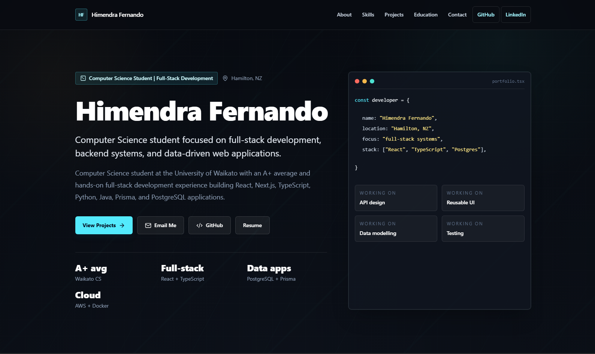

# Himendra Fernando Portfolio 🚀

A full-stack portfolio website for showcasing Himendra Fernando's software engineering work, technical skills, education, resume, and contact workflow. The project combines a fast React frontend with a production-minded ASP.NET Core backend, PostgreSQL persistence, automated tests, Docker packaging, and Terraform infrastructure for AWS.



## ✨ Highlights

- Responsive portfolio UI built with React, TypeScript, Vite, and Tailwind CSS.
- Structured portfolio content for profile, skills, projects, education, contact links, and resume.
- Public contact API with validation, rate limiting, CORS controls, and privacy-conscious IP hashing.
- Admin-ready contact submission endpoints protected by JWT bearer authentication.
- PostgreSQL data layer using Entity Framework Core migrations and clean project boundaries.
- Backend test coverage for API behavior, contact workflows, admin endpoints, and database model rules.
- Dockerfile and Terraform starter for deploying the API to AWS ECS Fargate with RDS PostgreSQL.

## 🧰 Tech Stack

### Frontend

- React 19
- TypeScript 6
- Vite 8
- Tailwind CSS 4
- lucide-react
- ESLint

### Backend

- .NET 8
- ASP.NET Core Minimal APIs
- Entity Framework Core 8
- PostgreSQL via Npgsql
- JWT bearer authentication
- ASP.NET Core rate limiting, CORS, health checks, and OpenAPI/Swagger
- xUnit, Microsoft.AspNetCore.Mvc.Testing, and EF Core InMemory for tests

### Infrastructure and DevOps

- Docker
- Terraform
- AWS ECS Fargate
- AWS ECR
- AWS RDS PostgreSQL
- AWS Secrets Manager
- AWS CloudWatch Logs
- AWS WAF
- Optional CloudFront HTTPS entry point
- GitHub Actions deployment skeleton with AWS OIDC

## 🏗️ Architecture

```text
React + Vite frontend
  -> portfolio content and static resume asset
  -> ASP.NET Core API
      -> public contact endpoint
      -> authenticated admin contact endpoints
      -> EF Core infrastructure layer
      -> PostgreSQL database
  -> AWS deployment path
      -> ALB / optional CloudFront
      -> ECS Fargate API container
      -> private RDS PostgreSQL
      -> Secrets Manager + CloudWatch + WAF
```

The backend is split into API, Application, Domain, Infrastructure, and Tests projects so the HTTP layer, business contracts, entities, persistence, and verification stay easy to reason about.

## 📁 Repository Structure

```text
.
|-- src/                         # React frontend source
|   |-- components/              # Portfolio UI sections and reusable components
|   |-- data/portfolio.ts        # Profile, project, skills, education, and contact content
|   |-- assets/                  # Project imagery
|   `-- styles/                  # Tailwind entry styles
|-- public/                      # Static assets, including the resume PDF
|-- api/                         # ASP.NET Core backend solution projects
|   |-- Himendra.Portfolio.Api
|   |-- Himendra.Portfolio.Application
|   |-- Himendra.Portfolio.Domain
|   |-- Himendra.Portfolio.Infrastructure
|   `-- Himendra.Portfolio.Tests
|-- infra/                       # Terraform AWS infrastructure
|-- docs/                        # Deployment and implementation notes
|-- package.json                 # Frontend scripts and dependencies
`-- Himendra.Portfolio.sln       # .NET solution
```

## 🚦 Getting Started

### Prerequisites

- Node.js and npm
- .NET 8 SDK
- Docker, if you want to build or run the API container
- Terraform, if you want to validate or deploy the AWS infrastructure
- PostgreSQL, if you want to run the API against a real local database

### Install Frontend Dependencies

```bash
npm install
```

### Run the Frontend

```bash
npm run dev
```

The Vite app runs locally at `http://localhost:5173` by default.

### Run the API

```bash
dotnet run --project api/Himendra.Portfolio.Api
```

The API launch profile uses:

- `http://localhost:5218`
- `https://localhost:7150`

Development CORS allows the local Vite origin when no explicit origins are configured.

## ✅ Quality Checks

Run frontend linting:

```bash
npm run lint
```

Create a production frontend build:

```bash
npm run build
```

Restore, build, and test the .NET solution:

```bash
dotnet restore Himendra.Portfolio.sln
dotnet build Himendra.Portfolio.sln
dotnet test Himendra.Portfolio.sln
```

## 🔐 Configuration

The backend uses `appsettings.Development.json` and environment variables for local configuration. Production secrets should never be committed.

Important production settings:

```text
ConnectionStrings__PortfolioDatabase
Authentication__Authority
Authentication__Audience
Security__IpHashSalt
Cors__AllowedOrigins__0
```

The contact API stores a salted hash of the source IP address instead of storing raw IP addresses. Configure a real production salt with `Security__IpHashSalt`.

## 📬 API Surface

Public contact submissions:

```http
POST /api/contact
Content-Type: application/json
```

Admin contact review endpoints require:

```text
Authorization: Bearer <token>
```

Additional backend details are documented in [api/README.md](api/README.md), [api/docs/database.md](api/docs/database.md), and [api/docs/admin-auth.md](api/docs/admin-auth.md).

## 📦 Docker

Build the API container from the repository root:

```bash
docker build -f api/Himendra.Portfolio.Api/Dockerfile -t himendra-portfolio-api:local .
```

See [infra/README.md](infra/README.md) for a full local Docker run example with environment variables.

## ☁️ Infrastructure

The `infra/` folder contains Terraform modules for an AWS deployment path:

- VPC networking
- Application Load Balancer
- ECS Fargate service
- ECR repository
- RDS PostgreSQL
- Secrets Manager
- CloudWatch Logs
- WAF managed protections
- Optional CloudFront distribution

Validate Terraform syntax from the dev environment:

```bash
cd infra/terraform/environments/dev
terraform fmt -recursive
terraform init -backend=false
terraform validate
```

See [infra/README.md](infra/README.md) for deployment notes, runtime settings, migration guidance, and AWS prerequisites.

## 🧑‍💻 Portfolio Content

Main portfolio content is managed in:

```text
src/data/portfolio.ts
```

Update this file to change the profile text, skills, project cards, education section, contact links, and resume path. The current resume asset lives in:

```text
public/himendra-fernando-cv.pdf
```

## 🧪 Testing Focus

Backend tests currently cover:

- API health and environment behavior
- CORS behavior
- Contact submission validation and persistence
- Contact endpoint rate-sensitive behavior
- Admin contact submission access and status updates
- EF Core database model and migration expectations

## 📌 Notes

- Frontend production output is generated in `dist/`.
- Swagger is enabled for development API inspection.
- Production API deployments should use environment variables or AWS Secrets Manager for sensitive values.
- Terraform examples are starter infrastructure and should be reviewed with a real `terraform plan` before deployment.
